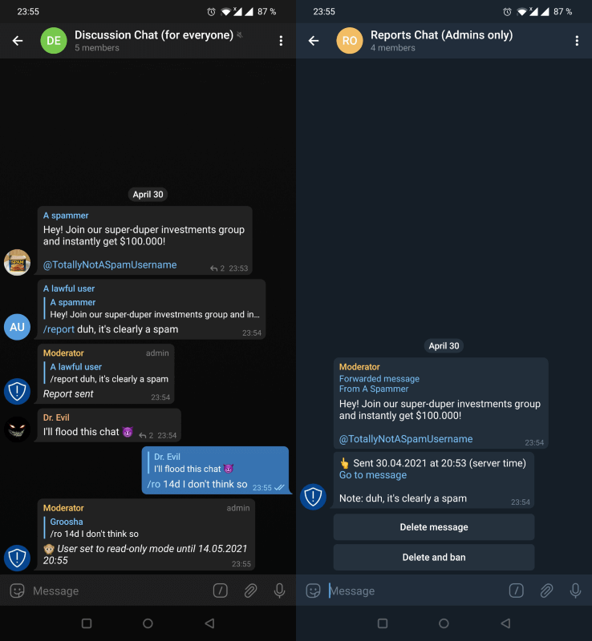

# Report bot for Telegram

 

This repository contains source code of a small yet rather powerful bot for Telegram, which handles reports from users and passes them to admins. 
Uses [aiogram](https://github.com/aiogram/aiogram) framework.  
The main goal is to build a bot with no external database needed. Thus, it may lack some features, but hey, it's open source!

⚠️ Warning: this bot can be used **ONLY** to notify people (most often, group admins), that someone might 
violate group's own rules. If you want to report some content to Telegram official support team, please use "Report" 
button in your app.

#### Screenshot

#### Features
* `/report` command to gather reports from users;  
* Reports will be sent to a separate group chat;  
* `/ro` command to set user "read-only";
* [optional] Automatically remove "user joined" service messages;  
* [optional] Automatically ban channels (since 
[December 2021](https://telegram.org/blog/protected-content-delete-by-date-and-more#anonymous-posting-in-public-groups) 
users can write on behalf of their channels);  
* If message starts with `@admin` or `@admins`, admins are notified;  
* A simple interface for admins to choose one of actions on reported message;  
* Use any locale you want, examples for English and Russian languages are included.

#### Requirements
* Python 3.11+ (developed under 3.12);  
* Systemd (you can use it to enable autostart and autorestart), Docker or anything else you prefer.

#### Installation  
1. Go to [@BotFather](https://t.me/telegram), create a new bot, write down its token, add it to your existing group 
and **make bot an admin**. You also need to give it "Delete messages" permission.  
2. Create a separate group where report messages will be sent and add all group admins there. 
**Remember**: anyone who is in that group may perform actions like "Delete", "Ban" and so on, so be careful.  
3. Use some bot like [@my_id_bot](https://t.me/my_id_bot) to get IDs of these two groups;  
4. Clone this repo and `cd` into it;  
5. Copy `settings.example.toml` to `settings.toml`.
6. Replace default values with your own;  
7. Now choose installation method: **systemd** or **Docker**

##### systemd
1. Create a venv (virtual environment): `python3.12 -m venv venv` (or any other Python 3.11+ version);  
2. `source venv/bin/activate && pip install -r requirements.txt`;
3. Rename  `reportbot.service.example` to `reportbot.service` and move it to `/etc/systemd/system`;  
4. Open that file and change values for `WorkingDirectory`, `ExecStart` and `EnvironmentFile` providing the correct 
path values;  
5. Start your bot and enable its autostart: `sudo systemctl enable reportbot.service --now`;  
6.Check your bot's status and logs: `systemctl status reportbot.service`.

##### Docker
1. Copy `docker-compose.example.yml` as `docker-compose.yml`. 
2. Open it and edit values
3. Build and run your container: `docker-compose up -d`.
