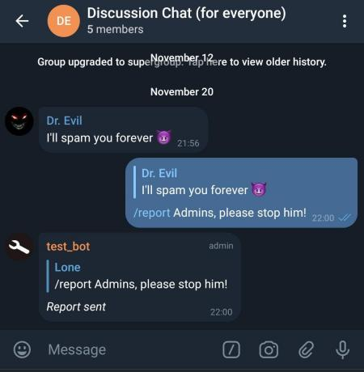
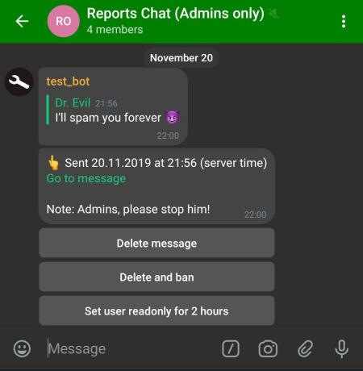

# Report bot for Telegram

This repository contains sources of a small yet rather powerful bot for Telegram, which handles reports from users and passes them to admins. Uses [aiogram](https://github.com/aiogram/aiogram) framework.  
The main goal was to build a bot with no external database needed. Thus, it may lack some features, but hey, it's open source!

#### Screenshots
User reports a message:  

Admins take action:  

#### Features
* Handles `/report` command to gather reports from users;  
* Handles `/ro` command to set user "Read-only" and `/textonly` to allow text messages only;
* Removes "user joined" messages;  
* Reacts to short "greetings" messages like "Hey everyone", kindly asking user to proceed to their question or problem directly;  
* Provides a simple interface for admins to choose one of actions on reported message.

#### Requirements
* Python 3.7 and above;  
* Linux is mentioned in the following installation guide, but bot should also work on Windows: no platform-specific code is used;  
* Systemd (you can use it to enable autostart and autorestart) or Docker.

#### Installation  
1. Go to [@BotFather](https://t.me/telegram), create a new bot, write down its token, add it to your existing group 
and **make bot an admin**. You also need to give it "Delete messages" permission.  
2. Create a separate group where report messages will be sent and add all group admins there. 
**Remember**: anyone who is in that group may perform actions like "Delete", "Ban" and so on, so be careful.  
3. Use some bot like [@my_id_bot](https://t.me/my_id_bot) to get IDs of these two groups;  
3. Clone this repo and `cd` into it;  
4. Now choose installation method: **systemd** or **Docker**

##### systemd
1. Create a venv (virtual environment): `python3.7 -m venv venv` (or any other Python 3.7+ version);  
2. `source venv/bin/python && pip install -r requirements.txt`;  
3. `chmod +x bot.py`;  
4. Copy `env_dist` to `.env` (with dot). **Warning**: files starting with dot are usually hidden in Linux, 
so don't worry if you stop seeing this file, it's still here!  
5. Open `.env` file and set values for token, language and group IDs;  
6. Rename  `reportbot.service.example` to `reportbot.service` and move it to `/etc/systemd/system`;  
7. Open that file and change values for `WorkingDirectory`, `ExecStart` and `EnvironmentFile` providing the correct 
path values;  
8. Start your bot and enable its autostart: `sudo systemctl enable reportbot.service --now`;  
9. Check your bot's status and logs: `systemctl status reportbot.service`.

##### Docker
1. Copy `env_dist` to `.env` (with dot). **Warning**: files starting with dot are usually hidden in Linux, 
so don't worry if you stop seeing this file, it's still here!  
2. Open `.env` file and set values for token, language and group IDs;  
3. Build and run your container: `docker-compose up -d`.